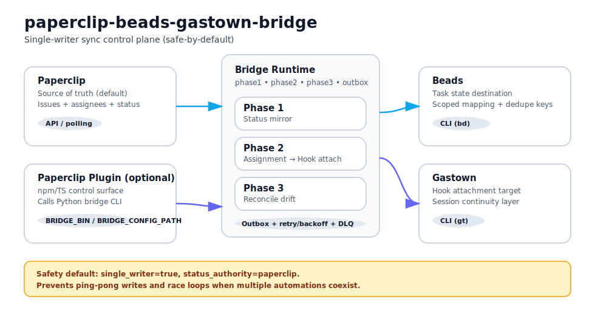
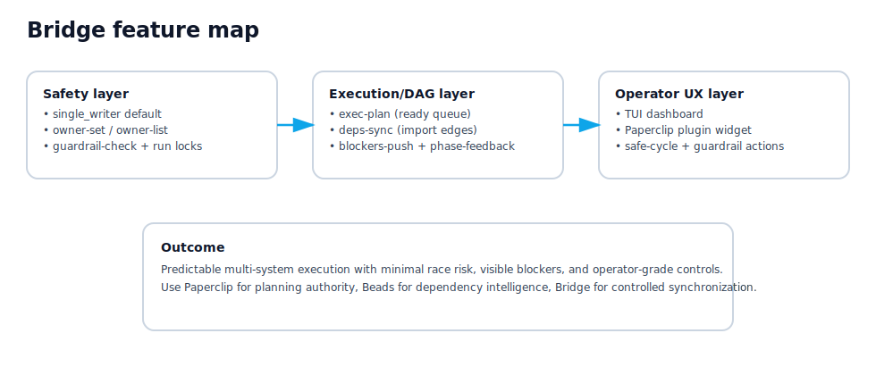
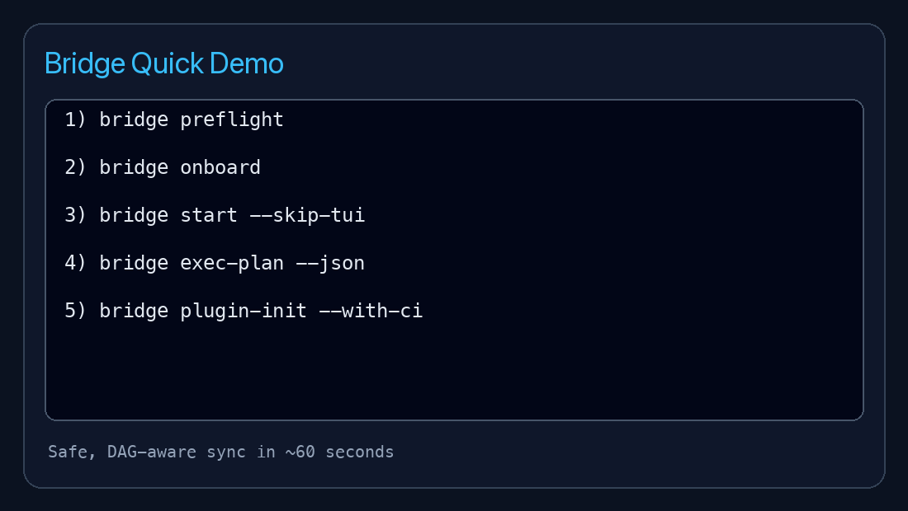

# paperclip-beads-gastown-bridge

<p>
  <a href="https://github.com/TarunKurella/paperclip-beads-gastown-bridge/actions/workflows/ci.yml">
    
  </a>
  
  
  
</p>

**A safe sync control plane for Paperclip + Beads + Gastown.**

- Human-friendly terminal UX
- Agent-friendly JSON mode
- Race-safe default (`single_writer=true`)
- Optional Paperclip plugin integration (without editing upstream repos)

---

## Why try this?

If your team coordinates work across Paperclip, Beads, and Gastown, this gives you one practical runtime for:

- status synchronization
- assignment to hook automation
- drift reconciliation
- reliable delivery via outbox + retries + DLQ

No fragile glue scripts. No source edits in the three upstream systems.

---

## Architecture



## Feature map



---

## 60-second quickstart

```bash
python3 -m venv .venv
source .venv/bin/activate
pip install -e '.[dev]'

bridge preflight
bridge onboard
bridge walkthrough
bridge start
```

## Quick demo (GIF)



---

## Human vs Agent flows

### Human / interactive

```bash
bridge preflight
bridge onboard
bridge walkthrough
bridge start
```

### Agent / non-interactive

```bash
bridge preflight --json
bridge onboard --yes --out config.real.local.json
bridge start --agent --quiet-json --config config.real.local.json
```

---

## Safety defaults (important)

- `single_writer = true`
- `status_authority = "paperclip"`

This prevents ping-pong writes and race loops when multiple automation systems coexist.

---

## Plugin integration (optional)

Scaffold a standalone Paperclip plugin wrapper:

```bash
bridge plugin-init \
  --output-dir ./integrations/plugin-bridge-ops \
  --package-name @acme/plugin-bridge-ops \
  --with-ci
```

This generates an npm/TS plugin that calls the Python `bridge` CLI.

---

## Game-changing features (what makes this different)

### 1) **No double-runs by design**
- execution ownership (`owner-set` / `owner-list`)
- run-lock guardrails
- pre-run gate check (`guardrail-check`)

### 2) **DAG-aware execution planning**
- `exec-plan` surfaces dependency-ready work from Beads
- `deps-sync` imports dependency edges at scale
- `blockers-push` propagates blocked/in-progress/done signals safely

### 3) **Safe plugin control surface**
- plugin widget gives operator UX for:
  - safe run cycle
  - guardrail checks
  - DAG ready queue
  - blocker push
- keeps npm plugin + python bridge split clean

### 4) **Race-safe architecture defaults**
- `single_writer=true`
- `status_authority=paperclip`
- bounded reverse communication only (no uncontrolled ping-pong)

## Commands you’ll actually use

```bash
bridge check --config config.real.local.json
bridge status --config config.real.local.json --json
bridge run-daemon --config config.real.local.json
bridge outbox-drain --config config.real.local.json
bridge dlq-replay --config config.real.local.json

# mapping + execution ownership
bridge map-add --config config.real.local.json --paperclip-id <id> --beads-id <id>
bridge owner-set --config config.real.local.json --paperclip-id <id> --owner beads_runner
bridge owner-list --config config.real.local.json --json

# paperclip lifecycle wrappers (atomic)
bridge checkout --config config.real.local.json --paperclip-id <id>
bridge release --config config.real.local.json --paperclip-id <id>
bridge comment --config config.real.local.json --paperclip-id <id> --body "sync note"

# safety + DAG flows
bridge guardrail-check --config config.real.local.json --paperclip-id <id> --json
bridge exec-plan --config config.real.local.json --json
bridge blockers-push --config config.real.local.json --comment-blockers
bridge phase-feedback --config config.real.local.json
bridge deps-sync --config config.real.local.json --edges-file ./edges.json --dry-run
```

---

## Multi-company support

Use company-scoped configs (recommended one worker per company), with:

- `paperclip_company_id`
- scoped mappings (`id_map_scoped`)
- scoped dedupe keys

---

## Docs

- [Quickstart](docs/quickstart.md)
- [Plugin integration](docs/plugin-integration.md)
- [Architecture diagram (SVG)](docs/architecture.svg)

---

## License

MIT
